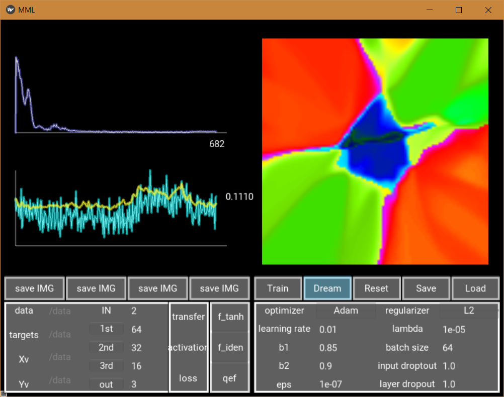
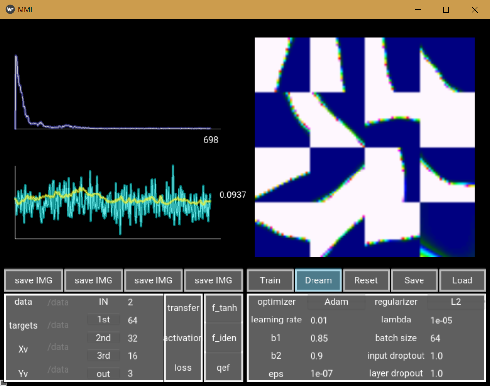
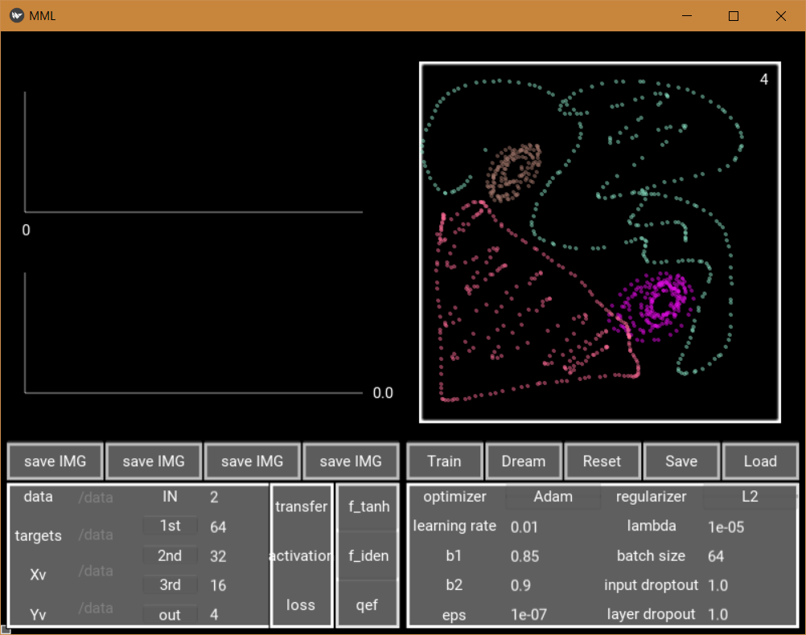
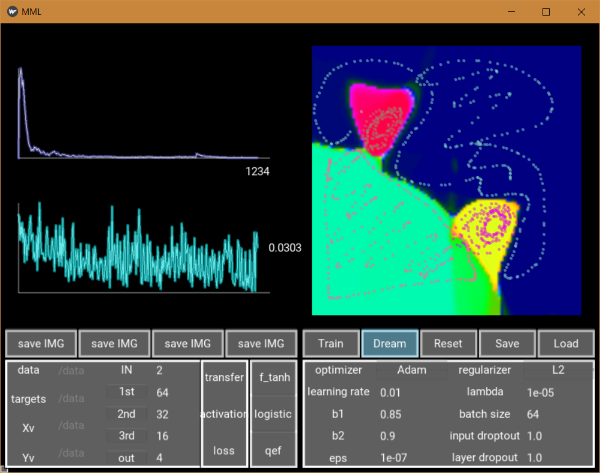

# MML
MML is live visualization tool for MLPs/neural networks. 

## how to use  
Dependencies:
* kivy (https://kivy.org/docs/installation/installation.html)
* numpy  
* scipy
* matplotlib
* pickle

1. clone repo  
2. open console:
```python MML.py```

## Examples
Per default, XOR data (with third class in the center) is used for training
 
Training data can also be drawn by hand.  
  

